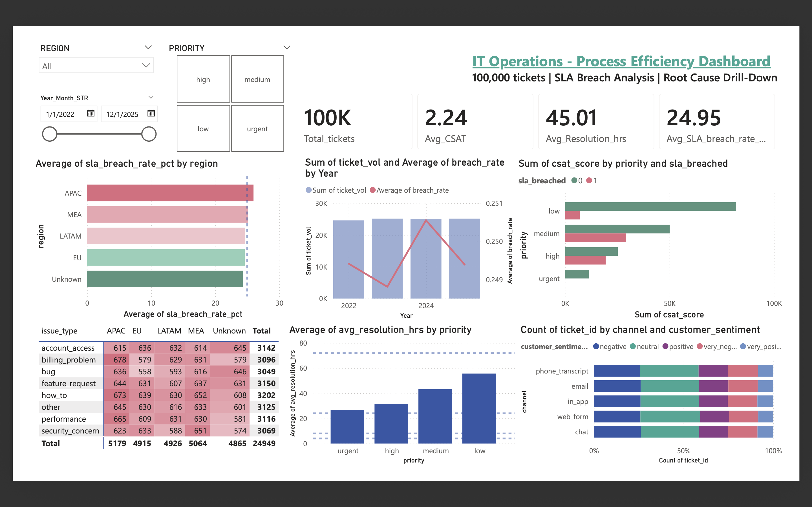

# IT Operations - Process Efficiency Dashboard

Operations-focused KPI analysis across 100,000 IT support tickets, tracking SLA breach rates, resolution time trends, and root cause breakdowns by region and issue type.

This project replicates the kind of KPI reporting I built at HP Inc., where I managed end-to-end claims reporting across EMEA and Asia-Pacific business units, supporting 200+ stakeholders.



---

## Business Questions

1. Which regions are breaching SLA targets the most?
2. Is the breach rate improving or getting worse over time?
3. What issue types are driving the most breaches, and where?
4. Does SLA breach actually impact customer satisfaction, and can we prove it statistically?

---

## Key Findings

| Metric | Value |
|--------|-------|
| Total tickets analyzed | 100,000 |
| Average resolution time | 45.01 hours |
| Overall SLA breach rate | 24.95% |
| Average CSAT score | 2.24 out of 5 |
| Highest breach region | APAC |
| Top breach driver | Billing problems (APAC) |

- APAC leads SLA breaches at around 28%, above the 25% target, pointing to a staffing or process gap in that region
- Billing problems and how-to tickets are the top breach drivers across all regions, suggesting a knowledge base gap rather than a headcount issue
- Low priority tickets average 65+ hours to resolve, indicating backlog management problems rather than triage failures
- SLA breach leads to measurably lower CSAT scores, confirmed statistically using the Mann-Whitney U test (p < 0.05), providing a data-backed case for SLA investment
- Breach rate spiked in 2024 despite stable ticket volume, suggesting a process degradation event worth investigating

---

## Tools Used

| Layer | Tool |
|-------|------|
| Data ingestion | kagglehub |
| Data processing | pandas, numpy |
| Statistical analysis | scipy (Mann-Whitney U test) |
| Python visualizations | matplotlib, seaborn |
| Interactive dashboard | Power BI Desktop |
| Version control | Git, GitHub |

Power BI was chosen over Tableau because it is the enterprise standard used at HP, Oracle, and most Fortune 500 operations teams, and maps directly to the job market for ops and BA roles.

---

## Project Structure

```
Ops-KPI-dashboard-ITSM/
│
├── 01_ops_kpi_dashboard.ipynb       - full analysis pipeline
│
├── data/
│   └── processed/
│       ├── itsm_cleaned.csv         - cleaned dataset with SLA breach flags
│       ├── kpi_by_region.csv        - KPI summary by region
│       ├── kpi_by_priority.csv      - KPI summary by priority tier
│       ├── monthly_sla_trend.csv    - breach rate and volume by month
│       └── root_cause_breach.csv    - breach counts by issue type and region
│
├── visuals/
│   ├── dashboard_preview.png        - Power BI dashboard screenshot
│   ├── 01_sla_breach_by_region.png
│   ├── 02_monthly_sla_trend.png
│   ├── 03_root_cause_heatmap.png
│   ├── 04_resolution_dist_by_priority.png
│   ├── 05_csat_vs_sla.png
│   ├── 06_volume_channel_segment.png
│   └── 07_correlation_matrix.png
│
├── IT Operations - Process Efficiency Dashboard.pdf   - exported dashboard
├── requirements.txt
├── .gitignore
└── README.md
```

---

## How to Run

Install dependencies:
```bash
pip install -r requirements.txt
```

Run the notebook:
```bash
jupyter notebook 01_ops_kpi_dashboard.ipynb
```

The notebook downloads the dataset automatically via kagglehub. You will need a free Kaggle account with an API token saved at `~/.kaggle/kaggle.json`.

Processed CSVs export to `data/processed/` and charts save to `visuals/` automatically when you run all cells.

For the Power BI dashboard, open Power BI Desktop and load the files from `data/processed/` via Get Data - Text/CSV.

---

## Statistical Note

I used the Mann-Whitney U test to validate whether SLA-breached tickets have significantly lower CSAT scores compared to tickets where SLA was met. I chose this over a t-test because CSAT is a 1-5 ordinal scale and is not normally distributed. With a p-value below 0.05, the difference is statistically significant.

---

## Dataset

Source: [Synthetic IT Support Tickets - Kaggle](https://www.kaggle.com/datasets/ahsanneural/synthetic-it-support-tickets)

100,000 records, 20 features, usability score 9.4/10. Synthetic dataset modeled on real ITSM workflows. Used to simulate the type of operational data encountered in enterprise claims management environments, since actual enterprise data is confidential.

---

## What I Would Do Differently With Real Enterprise Data

- Connect Power BI directly to a SQL Server or Snowflake warehouse instead of flat CSVs
- Build automated daily refresh pipelines so the dashboard updates without manual exports
- Add a predictive layer using logistic regression to flag tickets likely to breach SLA before they do
- Incorporate agent workload data to see whether breach spikes correlate with staffing levels
- Apply row-level security in Power BI so regional managers only see their own data

---

## Author

Saran Chandrasekharan Unnithan
M.S. Engineering Management, GPA 4.0 - University of Memphis
NSF I-Corps Cohort | TTAC Innovation Fellow

[LinkedIn](https://www.linkedin.com/in/sarancur/) | [GitHub](https://github.com/sarancur)

---

Part of a structured portfolio built to demonstrate enterprise-grade operations analytics capabilities.
